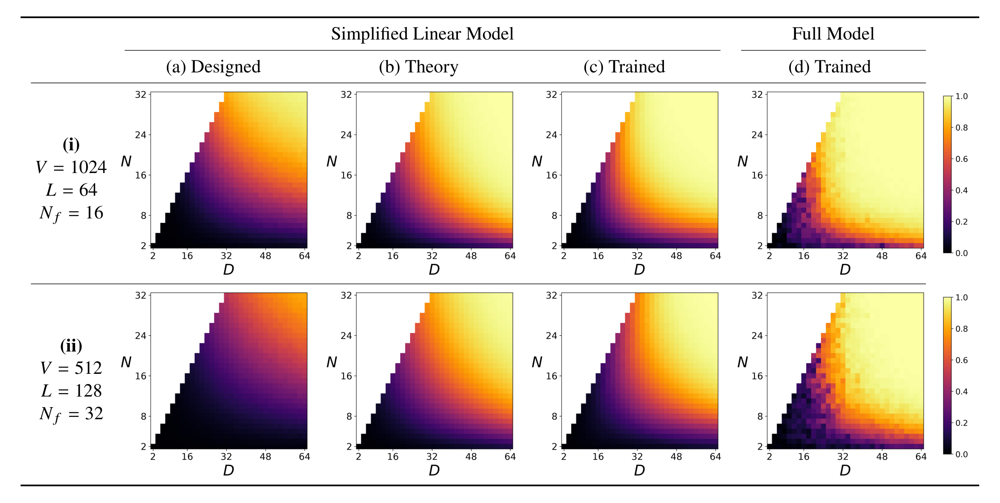
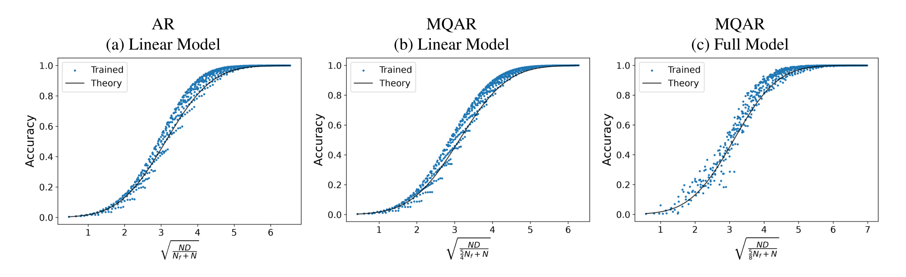
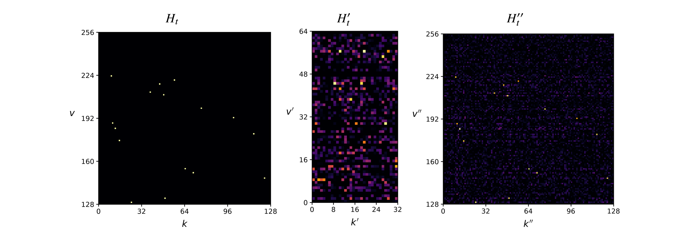
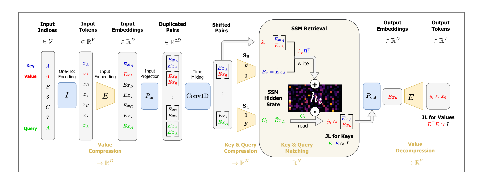

# On the Recall Scaling Laws in Mamba

[Yuval Koren](https://github.com/yuvalko1) · [Assaf Ben-Kish](https://assafbk.github.io/website/) · [Raja Giryes](https://www.giryes.sites.tau.ac.il/) · [Lior Wolf](https://www.cs.tau.ac.il/~wolf/) · [Itamar Zimerman](https://itamarzimm.github.io/)

Blavatnik School of Computer Science and AI, Tel Aviv University

[](https://arxiv.org/abs/2609.07681)
[](LICENSE)

This repository contains the code for the paper
["On the Recall Scaling Laws in Mamba: A Theoretical and Mechanistic Study via Hashing"](https://arxiv.org/abs/2609.07681).

In this work, we:

1. Propose a minimal recall circuit for Mamba: the model can perform recall by implicitly
   learning linear hash functions.
2. Reverse-engineer the exact internal algorithm used by trained Mamba models, showing
   that this circuit is learned in practice.
3. Develop a theoretical framework we term *Recall Scaling Laws*: given the vocabulary
   size and the number of facts in context, it predicts the model dimensions required
   for perfect recall, and the recall success probability given the dimensions.
4. Show empirically that these theoretical findings are accurate and predictive,
   across single-layer, multi-layer and multi-head Mamba models.

---

<p align="center">
  
</p>

> **Mamba recall scaling laws: theory versus empirical results.** Recall accuracy, represented by pixel color, against model embedding dimension $D$ and state size $N$. Left to right: (a) simplified linear Mamba model with designed fixed weights, (b) theoretical scaling law, (c) trained linear model, (d) trained full model. Each row represents a different regime of MQAR parameters.

<p align="center">
  
</p>

> **Single-layer recall scaling laws.** As predicted by our theory, trained Mamba accuracy collapses onto one-dimensional curves of the form $p_\mathrm{recall}(x) \approx \Phi(x-b)$, where $x=\tfrac{1}{\sigma}$ with $\sigma^2=\tfrac{aN_f}{ND}+\tfrac{1}{D}$ and $a$ depends on the task, $b \approx \sqrt{2\log V}$, and $\Phi$ is the standard normal CDF. **Left to right:** (a) Linear model on AR: $a=1$. (b) Linear model on MQAR: $a \approx \tfrac{5}{4}$, as increased number of queries implies larger variance. (c) Full nonlinear Mamba also fits the same law, with $a_\mathrm{full} \approx \tfrac{1}{2} a_\mathrm{linear}$ (determined heuristically), indicating improved performance yet a similar scaling behavior.

<p align="center">
  
</p>

> **Interpreting the hidden state.** The context key-value information $H_t$ (left) is compressed by the model into a hidden state $H'_t$ (middle), which lacks clear interpretability. Projection onto vocabulary space (right) reveals an interpretable pattern: $H''_t \approx H_t$, indicating that a compression-decompression scheme is learned.

<p align="center">
  <a href="figures/external/minimal_recall_circuit.pdf">
    
  </a>
</p>

> **Minimal recall circuit.** Left to right: (1) tokens are embedded using $E$; (2) $P_\mathrm{in}$ and Conv1D apply duplication, copy and shift, forming (previous, current) embedding pairs; (3) the SSM projections $S_B$, $S_C$ extract keys and queries, further compressed via the JL matrix $\tilde{E}=FE$; (4) embedding pairs are stored in the SSM state $`h_t=\sum_\tau^t \hat{x}_\tau B_\tau^\top`$; (5) retrieval works by key-query matching, $`h_t C_t \approx \hat{x}_\tau`$; (6) $`P_\mathrm{out}`$ selects the value half; (7) the JL matrix $E$ reconstructs the value token, $y_t = E^\top E x_\tau \approx x_\tau$.

---

## Repository layout

| Path | Contents |
| --- | --- |
| `src/` | Training and evaluation code (`main.py`), model implementations, and theory computations (`src/theory/`). |
| `config/` | One JSON5 config per paper experiment; `config/appendix/` holds appendix-only experiments. |
| `scripts/` | Setup and utility scripts; `scripts/figures/` renders all paper figures. |
| `saved_runs_data/` | Committed result bundles (run config + accuracy grids) - all data behind the paper figures, no external downloads. |
| `figures/` | Rendered paper-format figure PNGs (body, `appendix/`, and the README's `external/`). |
| `test/` | Test suite (see [Tests](#tests)). |

## Setup

Requirements:
- Linux
- Python 3.12
- NVIDIA GPU with a CUDA-enabled driver

Tested under NVIDIA driver 580.173 with CUDA 12.8 wheels (B200 GPUs); the CPU-only paths
(figure rendering, dry tests) are also tested on macOS (arm64).

To set up the environment, run:

```bash
bash scripts/setup_venv.sh
```

The script creates `.venv`, installs a pinned `torch`, verifies CUDA with a GPU matmul,
installs `requirements.txt` (versions pinned via `constraints.txt`), and then installs
prebuilt `causal-conv1d` + `mamba-ssm` wheels with a forward/backward smoke test.

**`mamba-ssm` is optional.** Only the full-Mamba configs (`"class": "mamba_ssm"`) need it;
all other configs use the pure-PyTorch `mamba_tiny` path and work without it. If the wheel
install fails, the setup script continues and says so.

Troubleshooting: `torch` is pinned *before* the wheels and the wheels are installed with
`--no-deps` on purpose - their transitive dependencies would otherwise silently upgrade
`torch` and break ABI compatibility with the prebuilt `.so` files. If you change the torch
version, change the wheel tags in `scripts/setup_venv.sh` to match.

## Quickstart

Activate the environment:

```bash
source .venv/bin/activate
```

Log in to [Weights & Biases](https://wandb.ai) - training runs log their live per-cell
accuracy grids there; figures and tests don't need it (if you don't have an account, create one):

```bash
wandb login
```

Optionally, run sanity-check examples - two small 4x4 D-N grids, one per model implementation.
Both train on `cuda:0`; we recommend viewing the training progress live in W&B.

Simplified linear Mamba (~2 minutes on a single B200 GPU):

```bash
python src/main.py -c config/MQAR__D_N__linear_trained__example.json5
```

Full Mamba (~10 minutes on a single B200 GPU; needs `mamba-ssm`):

```bash
python src/main.py -c config/MQAR__D_N__full_trained__example.json5
```

Note: the simplified linear model can also run on CPU - if no GPU is found, it falls back
automatically to use CPU and trains correctly, just slower. However, recommended usage is
with GPU; paper figures were run on GPU. The full model requires a real GPU (`mamba-ssm`'s
CUDA kernels).

Results land in the `results/` dir: the exact run config plus one accuracy grid per split. The val grid shows the paper's scaling-laws pattern (a (D-axis, N-axis) grid); non-feasible
cells are skipped as `nan`. 

You can load and view these grids with numpy: 
```python
python

>>> import glob, numpy as np
>>> run_results_dir = glob.glob("results/MQAR__D_N__linear_trained__example/*")[0]
>>> np.load(f"{run_results_dir}/accuracy_grid__val.npy").round(2)  # load D-N accuracy grid

array([[[0.24, 0.32,  nan,  nan],
        [0.64, 0.89, 0.94, 0.95],
        [0.82, 0.98, 1.  , 1.  ],
        [0.89, 1.  , 1.  , 1.  ]]])
```

Re-run paper experiments with the same command on any `config/` file. A possible good starting point is
the mechanistic interpretability D-N grid - the smallest paper grid (V=256, a single seed), which
also saves best-model weights per cell (later used to prepare the mechanistic interpretability figures):

```bash
python src/main.py -c config/MQAR__D_N__linear_trained__mech_interp.json5
```

For the actual paper-scale grids (long runs, multiple GPUs), you can also use
[`scripts/run_multi_grids_across_gpus.sh`](scripts/run_multi_grids_across_gpus.sh): edit its
`RUNS` array with `(gpu, config)` pairs - see `config/` for the full set of paper configs -
and launch it:

```bash
bash scripts/run_multi_grids_across_gpus.sh
```

Note it runs detached; `setsid`+`nohup`, survives SSH disconnects. Script logs land under `logs/`.

## Reproducing paper figures

All paper figures are committed in [`figures/`](figures/), and every figure regenerates
from the committed [`saved_runs_data/`](saved_runs_data/) bundles **without retraining**
(seconds, CPU-only). Regenerate everything - body, appendix, and optionally the README
figures - with:

```bash
bash scripts/figures/make_all_figures.sh
```

or per family. 2D scaling grids:

```bash
python scripts/figures/make_grid_figures.py
```

1D scaling curves:

```bash
python scripts/figures/make_scaling_curve_figures.py
```

Mechanistic interpretability figures:

```bash
python scripts/figures/make_mech_interp_figures.py
```

Appendix-only figures, one script per figure:

```bash
python scripts/figures/appendix/make_<name>_figures.py
```

The figure manifest is [`scripts/figures/config.json5`](scripts/figures/config.json5):
it maps every figure to its `saved_runs_data/` bundle, and each bundle's archived
`run_config.json5` is a byte-identical copy of its `config/` file (enforced by tests).

## Tests

To run repository tests, inside the `.venv`, simply run:

```bash
pytest
```

A bare `pytest` routes itself:

- Dry tests (no GPU, no training; includes a full figure-regeneration pass) always run.
- Wet tests (training, including an end-to-end micro grid) run when a usable CUDA GPU is found.
- In a CPU-only environment, wet tests using the simplified linear model also run (just slower).
- In a CPU-only environment, full-model tests are skipped, since they require `mamba-ssm`
  and `causal-conv1d`.
- Tests don't require W&B, but the suite warns when `wandb login` is not configured
  (since it is recommended for training runs).

## Weights & Biases

Training runs log to W&B (run `wandb login` once): each grid gets a descriptive project
name with live per-cell accuracy monitoring. Figures and tests don't need it.

## Acknowledgements

We highly thank the authors of the following open-source repositories:

- [`mamba`](https://github.com/state-spaces/mamba) and [`causal-conv1d`](https://github.com/Dao-AILab/causal-conv1d)
- [`mamba-tiny`](https://github.com/PeaBrane/mamba-tiny), derived from [`mamba-minimal`](https://github.com/johnma2006/mamba-minimal)
- [`zoology`](https://github.com/HazyResearch/zoology)

for their excellent work, which this project builds on. Vendored code under
`src/mamba_tiny/` and `src/mqar_zoology/` retains its upstream licenses and notices.

## Citation

```bibtex
@misc{koren2026recallscalinglawsmamba,
      title={On the Recall Scaling Laws in Mamba: A Theoretical and Mechanistic Study via Hashing},
      author={Yuval Koren and Assaf Ben-Kish and Raja Giryes and Lior Wolf and Itamar Zimerman},
      year={2026},
      eprint={2609.07681},
      archivePrefix={arXiv},
      primaryClass={cs.LG},
      url={https://arxiv.org/abs/2609.07681},
}
```

## License

Original code is released under the [MIT License](LICENSE). Vendored third-party code
keeps its own upstream licenses. Questions and issues are welcome via GitHub issues.
